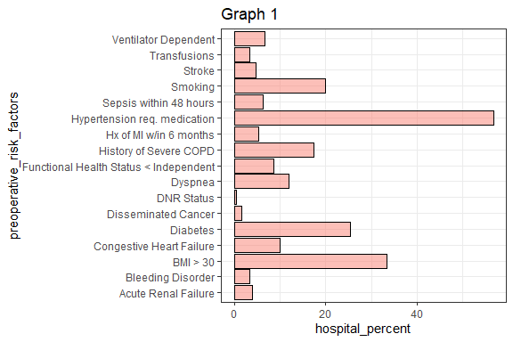
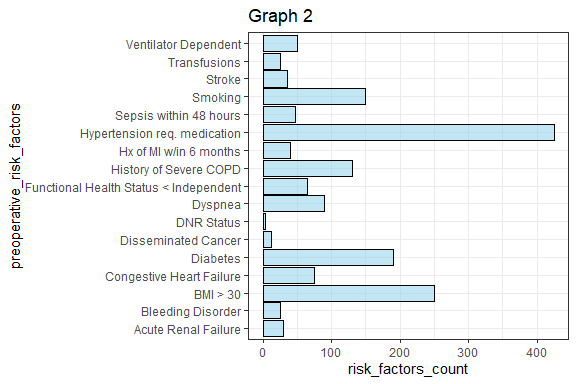

This report (add a brief description and the purpose of the report)
Demonstration of the __COMBINED__ template

<!--  Set the working directory to the repository's base directory; this assumes the report is nested inside of two directories.-->


# Environment
<!-- Load 'sourced' R files.  Suppress the output when loading packages. --> 

```r
library(magrittr)  # pipes
library(dplyr)     # data wrangling
library(ggplot2)   # graphs
library(janitor)   # tidy data
library(tidyr)     # data wrangling
library(forcats)   # factors
library(stringr)   # strings
library(lubridate) # dates
```

<!-- Load the sources.  Suppress the output when loading sources. --> 

```r
source("../../scripts/common-functions.R")
```

<!-- Load any Global functions and variables declared in the R file.  Suppress the output. --> 

```r
# custom function for HTML tables
neat <- function(x, output_format = "html"){ 
  # knitr.table.format = output_format
  if(output_format == "pandoc"){
    x_t <- knitr::kable(x, format = "pandoc")
  }else{
    x_t <- x %>%
      # x %>%
      # neat() %>%
      knitr::kable(format=output_format) %>%
      kableExtra::kable_styling(
        bootstrap_options = c("striped", "hover", "condensed","responsive"),
        # bootstrap_options = c( "condensed"),
        full_width = F,
        position = "left"
      )
  } 
  return(x_t)
}
# Note: when printing to Word or PDF use `neat(output_format =  "pandoc")`
```


# Data

```r
path_file <- "../../data-public/raw/Tableau_10_Training_Files/Tableau 10 Training Practice Data.xlsx"
sheet_names <- readxl::excel_sheets(path_file)
dto <- list()
for(sheet_i in sheet_names){
   # i <- sheet_names[1]
  dto[[sheet_i]] <- readxl::read_xlsx(path_file, sheet = sheet_i)
}
ds_raw <- dto$`01 - Preoperative Risk Factors`
```


```
Rows: 17
Columns: 5
$ preoperative_risk_factors <chr> "Acute Renal Failure", "Bleeding Disorder", "BMI > 30", "Cong...
$ risk_factors_count        <dbl> 30, 25, 250, 75, 190, 12, 4, 90, 65, 130, 40, 425, 48, 150, 3...
$ surgical_cases_count      <dbl> 750, 750, 750, 750, 750, 750, 750, 750, 750, 750, 750, 750, 7...
$ hospital_percent          <dbl> 4.0000000, 3.3333333, 33.3333333, 10.0000000, 25.3333333, 1.6...
$ comparison_percent        <dbl> 3.0, 2.0, 40.0, 15.0, 35.0, 1.2, 0.3, 15.0, 10.0, 15.0, 4.5, ...
```

# Analysis

<table class="table table-striped table-hover table-condensed table-responsive" style="width: auto !important; ">
 <thead>
  <tr>
   <th style="text-align:left;"> preoperative_risk_factors </th>
   <th style="text-align:right;"> risk_factors_count </th>
   <th style="text-align:right;"> surgical_cases_count </th>
   <th style="text-align:right;"> hospital_percent </th>
   <th style="text-align:right;"> comparison_percent </th>
  </tr>
 </thead>
<tbody>
  <tr>
   <td style="text-align:left;"> Acute Renal Failure </td>
   <td style="text-align:right;"> 30 </td>
   <td style="text-align:right;"> 750 </td>
   <td style="text-align:right;"> 4.0000000 </td>
   <td style="text-align:right;"> 3.0 </td>
  </tr>
  <tr>
   <td style="text-align:left;"> Bleeding Disorder </td>
   <td style="text-align:right;"> 25 </td>
   <td style="text-align:right;"> 750 </td>
   <td style="text-align:right;"> 3.3333333 </td>
   <td style="text-align:right;"> 2.0 </td>
  </tr>
  <tr>
   <td style="text-align:left;"> BMI &gt; 30 </td>
   <td style="text-align:right;"> 250 </td>
   <td style="text-align:right;"> 750 </td>
   <td style="text-align:right;"> 33.3333333 </td>
   <td style="text-align:right;"> 40.0 </td>
  </tr>
  <tr>
   <td style="text-align:left;"> Congestive Heart Failure </td>
   <td style="text-align:right;"> 75 </td>
   <td style="text-align:right;"> 750 </td>
   <td style="text-align:right;"> 10.0000000 </td>
   <td style="text-align:right;"> 15.0 </td>
  </tr>
  <tr>
   <td style="text-align:left;"> Diabetes </td>
   <td style="text-align:right;"> 190 </td>
   <td style="text-align:right;"> 750 </td>
   <td style="text-align:right;"> 25.3333333 </td>
   <td style="text-align:right;"> 35.0 </td>
  </tr>
  <tr>
   <td style="text-align:left;"> Disseminated Cancer </td>
   <td style="text-align:right;"> 12 </td>
   <td style="text-align:right;"> 750 </td>
   <td style="text-align:right;"> 1.6000000 </td>
   <td style="text-align:right;"> 1.2 </td>
  </tr>
  <tr>
   <td style="text-align:left;"> DNR Status </td>
   <td style="text-align:right;"> 4 </td>
   <td style="text-align:right;"> 750 </td>
   <td style="text-align:right;"> 0.5333333 </td>
   <td style="text-align:right;"> 0.3 </td>
  </tr>
  <tr>
   <td style="text-align:left;"> Dyspnea </td>
   <td style="text-align:right;"> 90 </td>
   <td style="text-align:right;"> 750 </td>
   <td style="text-align:right;"> 12.0000000 </td>
   <td style="text-align:right;"> 15.0 </td>
  </tr>
  <tr>
   <td style="text-align:left;"> Functional Health Status &lt; Independent </td>
   <td style="text-align:right;"> 65 </td>
   <td style="text-align:right;"> 750 </td>
   <td style="text-align:right;"> 8.6666667 </td>
   <td style="text-align:right;"> 10.0 </td>
  </tr>
  <tr>
   <td style="text-align:left;"> History of Severe COPD </td>
   <td style="text-align:right;"> 130 </td>
   <td style="text-align:right;"> 750 </td>
   <td style="text-align:right;"> 17.3333333 </td>
   <td style="text-align:right;"> 15.0 </td>
  </tr>
  <tr>
   <td style="text-align:left;"> Hx of MI w/in 6 months </td>
   <td style="text-align:right;"> 40 </td>
   <td style="text-align:right;"> 750 </td>
   <td style="text-align:right;"> 5.3333333 </td>
   <td style="text-align:right;"> 4.5 </td>
  </tr>
  <tr>
   <td style="text-align:left;"> Hypertension req. medication </td>
   <td style="text-align:right;"> 425 </td>
   <td style="text-align:right;"> 750 </td>
   <td style="text-align:right;"> 56.6666667 </td>
   <td style="text-align:right;"> 61.0 </td>
  </tr>
  <tr>
   <td style="text-align:left;"> Sepsis within 48 hours </td>
   <td style="text-align:right;"> 48 </td>
   <td style="text-align:right;"> 750 </td>
   <td style="text-align:right;"> 6.4000000 </td>
   <td style="text-align:right;"> 4.5 </td>
  </tr>
  <tr>
   <td style="text-align:left;"> Smoking </td>
   <td style="text-align:right;"> 150 </td>
   <td style="text-align:right;"> 750 </td>
   <td style="text-align:right;"> 20.0000000 </td>
   <td style="text-align:right;"> 17.0 </td>
  </tr>
  <tr>
   <td style="text-align:left;"> Stroke </td>
   <td style="text-align:right;"> 35 </td>
   <td style="text-align:right;"> 750 </td>
   <td style="text-align:right;"> 4.6666667 </td>
   <td style="text-align:right;"> 4.0 </td>
  </tr>
  <tr>
   <td style="text-align:left;"> Transfusions </td>
   <td style="text-align:right;"> 25 </td>
   <td style="text-align:right;"> 750 </td>
   <td style="text-align:right;"> 3.3333333 </td>
   <td style="text-align:right;"> 5.0 </td>
  </tr>
  <tr>
   <td style="text-align:left;"> Ventilator Dependent </td>
   <td style="text-align:right;"> 50 </td>
   <td style="text-align:right;"> 750 </td>
   <td style="text-align:right;"> 6.6666667 </td>
   <td style="text-align:right;"> 4.2 </td>
  </tr>
</tbody>
</table>

<!-- -->

<!-- -->

Session Information {#session-info}
===========================================================================

For the sake of documentation and reproducibility, the current report was rendered in the following environment.  Click the line below to expand.

<details>
  <summary>Environment <span class="glyphicon glyphicon-plus-sign"></span></summary>

```
- Session info -----------------------------------------------------------------------------------
 setting  value                       
 version  R version 4.0.3 (2020-10-10)
 os       Windows 10 x64              
 system   x86_64, mingw32             
 ui       RTerm                       
 language (EN)                        
 collate  English_United States.1252  
 ctype    English_United States.1252  
 tz       America/New_York            
 date     2021-01-03                  

- Packages ---------------------------------------------------------------------------------------
 package     * version date       lib source        
 assertthat    0.2.1   2019-03-21 [1] CRAN (R 4.0.2)
 backports     1.1.7   2020-05-13 [1] CRAN (R 4.0.0)
 callr         3.4.3   2020-03-28 [1] CRAN (R 4.0.2)
 cellranger    1.1.0   2016-07-27 [1] CRAN (R 4.0.2)
 cli           2.0.2   2020-02-28 [1] CRAN (R 4.0.2)
 colorspace    1.4-1   2019-03-18 [1] CRAN (R 4.0.2)
 crayon        1.3.4   2017-09-16 [1] CRAN (R 4.0.2)
 desc          1.2.0   2018-05-01 [1] CRAN (R 4.0.2)
 devtools      2.3.1   2020-07-21 [1] CRAN (R 4.0.2)
 digest        0.6.25  2020-02-23 [1] CRAN (R 4.0.2)
 dplyr       * 1.0.1   2020-07-31 [1] CRAN (R 4.0.2)
 ellipsis      0.3.1   2020-05-15 [1] CRAN (R 4.0.2)
 evaluate      0.14    2019-05-28 [1] CRAN (R 4.0.2)
 fansi         0.4.1   2020-01-08 [1] CRAN (R 4.0.2)
 farver        2.0.3   2020-01-16 [1] CRAN (R 4.0.2)
 forcats     * 0.5.0   2020-03-01 [1] CRAN (R 4.0.2)
 fs            1.5.0   2020-07-31 [1] CRAN (R 4.0.2)
 generics      0.0.2   2018-11-29 [1] CRAN (R 4.0.2)
 ggplot2     * 3.3.2   2020-06-19 [1] CRAN (R 4.0.2)
 glue          1.4.1   2020-05-13 [1] CRAN (R 4.0.2)
 gtable        0.3.0   2019-03-25 [1] CRAN (R 4.0.2)
 highr         0.8     2019-03-20 [1] CRAN (R 4.0.2)
 htmltools     0.5.0   2020-06-16 [1] CRAN (R 4.0.2)
 httr          1.4.2   2020-07-20 [1] CRAN (R 4.0.2)
 janitor     * 2.0.1   2020-04-12 [1] CRAN (R 4.0.2)
 kableExtra    1.2.1   2020-08-27 [1] CRAN (R 4.0.2)
 knitr         1.29    2020-06-23 [1] CRAN (R 4.0.2)
 labeling      0.3     2014-08-23 [1] CRAN (R 4.0.0)
 lifecycle     0.2.0   2020-03-06 [1] CRAN (R 4.0.2)
 lubridate   * 1.7.9   2020-06-08 [1] CRAN (R 4.0.2)
 magrittr    * 1.5     2014-11-22 [1] CRAN (R 4.0.2)
 memoise       1.1.0   2017-04-21 [1] CRAN (R 4.0.2)
 munsell       0.5.0   2018-06-12 [1] CRAN (R 4.0.2)
 pillar        1.4.6   2020-07-10 [1] CRAN (R 4.0.2)
 pkgbuild      1.1.0   2020-07-13 [1] CRAN (R 4.0.2)
 pkgconfig     2.0.3   2019-09-22 [1] CRAN (R 4.0.2)
 pkgload       1.1.0   2020-05-29 [1] CRAN (R 4.0.2)
 prettyunits   1.1.1   2020-01-24 [1] CRAN (R 4.0.2)
 processx      3.4.3   2020-07-05 [1] CRAN (R 4.0.2)
 ps            1.3.4   2020-08-11 [1] CRAN (R 4.0.2)
 purrr         0.3.4   2020-04-17 [1] CRAN (R 4.0.2)
 R6            2.4.1   2019-11-12 [1] CRAN (R 4.0.2)
 Rcpp          1.0.5   2020-07-06 [1] CRAN (R 4.0.2)
 readxl        1.3.1   2019-03-13 [1] CRAN (R 4.0.2)
 remotes       2.2.0   2020-07-21 [1] CRAN (R 4.0.2)
 rlang         0.4.7   2020-07-09 [1] CRAN (R 4.0.2)
 rmarkdown     2.3     2020-06-18 [1] CRAN (R 4.0.2)
 rprojroot     1.3-2   2018-01-03 [1] CRAN (R 4.0.2)
 rstudioapi    0.11    2020-02-07 [1] CRAN (R 4.0.2)
 rvest         0.3.6   2020-07-25 [1] CRAN (R 4.0.2)
 scales        1.1.1   2020-05-11 [1] CRAN (R 4.0.2)
 sessioninfo   1.1.1   2018-11-05 [1] CRAN (R 4.0.2)
 snakecase     0.11.0  2019-05-25 [1] CRAN (R 4.0.2)
 stringi       1.4.6   2020-02-17 [1] CRAN (R 4.0.0)
 stringr     * 1.4.0   2019-02-10 [1] CRAN (R 4.0.2)
 testthat      2.3.2   2020-03-02 [1] CRAN (R 4.0.2)
 tibble        3.0.3   2020-07-10 [1] CRAN (R 4.0.2)
 tidyr       * 1.1.1   2020-07-31 [1] CRAN (R 4.0.2)
 tidyselect    1.1.0   2020-05-11 [1] CRAN (R 4.0.2)
 usethis       1.6.1   2020-04-29 [1] CRAN (R 4.0.2)
 utf8          1.1.4   2018-05-24 [1] CRAN (R 4.0.2)
 vctrs         0.3.2   2020-07-15 [1] CRAN (R 4.0.2)
 viridisLite   0.3.0   2018-02-01 [1] CRAN (R 4.0.2)
 webshot       0.5.2   2019-11-22 [1] CRAN (R 4.0.2)
 withr         2.2.0   2020-04-20 [1] CRAN (R 4.0.2)
 xfun          0.16    2020-07-24 [1] CRAN (R 4.0.2)
 xml2          1.3.2   2020-04-23 [1] CRAN (R 4.0.2)
 yaml          2.2.1   2020-02-01 [1] CRAN (R 4.0.2)

[1] C:/Users/an499583/OneDrive - University of Central Florida/Documents/R/win-library/4.0
[2] C:/Program Files/R/R-4.0.3/library
```
</details>


Report rendered by an499583 at 2021-01-03, 11:17 -0500 in 4 seconds.
